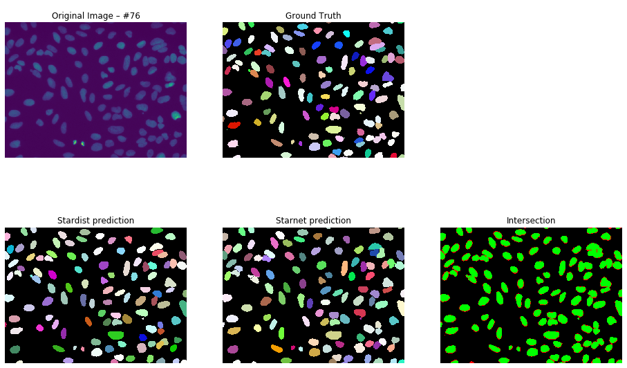

# Nuclear Segmentation

This repository is part of my Master thesis which was conducted in Jeffrey Chao's research group at the Friedrich Miescher Institute for Biomedical Research (Basel, Switzerland).

The majority of my wet lab work involved confocal microscopy of cellular samples. After realizing that traditional – thresholding based – approaches are only able to segment so much, I decided to develop a machine learning based method. The results are shown here.

Until everything is finalized, you can have a look at some preliminary results below. Note that some ground truth masks are not labeled leading to red / false intersections.

### Todo

- [ ] Improve README file
- [ ] Add requirements file
- [ ] Upload all annotated images
- [ ] Add other metrics to compare with different methods
- [ ] Find the optimal prediction parameters with UNet
- [ ] Test novel architectures as opposed to UNet
- [ ] ?
